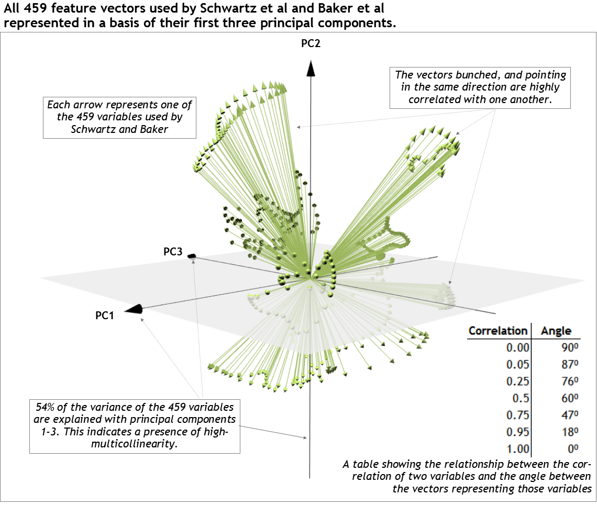

```{r, include=FALSE}
library(MASS)
library(dplyr)
library(ggplot2)
library(ggthemes)
library(ipsR)
library(stringr)
#I changed the source package to allow for some more flexibility. Load it. 
# detach("package:pca3d", unload=TRUE)
# remove.packages('pca3d')
# install.packages("C:/Users/marks/Documents/GitHub/pca3d_0.10.zip", repos=NULL, type="binary")
# install.packages("pca3d")
library(pca3d)
library(gridExtra)
library(grid)
library(latex2exp)
library(gtable)
library(dplyr)
library(tidyr)
library(nFactors)
library(pryr)
library(captioner)

source('Assemble_Source_Data.R')
source('Custom_Functions.R')
```

<!-- set up figure and table numbering and their captions-->
```{r include=FALSE}
table_nums <- captioner(prefix = "Table")
figure_nums <- captioner(prefix = "Figure")

gait_example_caption <- figure_nums("gait_example", "An example of a patient preparing for instrumented gait analysis")

gait_means_caption <- figure_nums("gait_means", "Reference population (n=32) means for nine joint angles across the gait cycle normalized to 51 points. These 459 total dimensions are the same as those used by Schwartz and Rozumalski[-@GDI] and Baker et al.[-@GPS] for their overall gait abnormality measures. This data was aggregated into a 32 x 459 matrix for the multicollinearity analysis.")

gait_data_PCA_caption <- figure_nums("gait_data_PCA", "All 459 feature vectors of the reference gait data matrix projected onto their first three eigenvectors (principal components). The non-random distribution of the vectors in this space indicate a strong dependency among the gait features.")

two_dim_example_caption <- figure_nums("two_dim_example", "A two-dimensional example of the non-independence bias problem when measuring overall abnormality with two correlated variables (r=0.83) and how that bias is addressed with the proposed methodology.")

high_dimensional_extension_example_caption <- figure_nums("high_dimensional_extension_example", "The results of a simulated extension of the example from Figure 4 into higher dimensional spaces. For each simulation iteration: 1) a reference population ($n=100$) was generated with all variables having $\\mu = 0$ and correlated with r = 0.75; 2) two subjects were then generated in which Subject 1 had all values equal 1 and Subject 2 had a random distribution of $\\frac{p}{2}$ values equal 1 and $\\frac{p}{2}$ values equal -1; 3) the mean absolute deviation was then taken between the simulated reference population and subjects in both the standard basis, and the principal component basis (following the methodology outlined and utilizing all principal components). This procedure was done 500 times and averaged for each value of p. The results show that the bias when measuring overall abnormality can actually increase as the number of dimensions increase and the true abnormality is reflected when using the proposed methodology.")

correlation_bias_relationship_caption <- figure_nums("correlation_bias_relationship", "A visual example of the relationship between correlation, eigenvalues and overall abnormality measurement. As correlation between the two variables increases, the difference in overall abnormality (i.e. Euclidean distance from the origin) between the standard basis and the principal component basis for the subject (orange) grows. This shows that the bias introduced when measuring overall abnormality in the standard basis increases as correlation increases.")


two_dim_change_of_basis_example_caption <- figure_nums("two_dim_change_of_basis_example","A two-dimensional example of the scaling that is done to ensure that each of the new independent variables has equal variance. This is done by dividing each new variable by the square root of its corresponding eigenvalue.  The square root of the eigenvalue is the standard deviation of its corresponding eigenvector.")

scree_plot_caption <- figure_nums("scree_plot","A scree plot with the results of some common methodologies used to determine the appropriate number of principal components when applied to the sample gait data")

pc_table_caption <- table_nums("pc_table","A breakdown of the first 32 Principal Components for the 459 Dimension Gait Data Sample")

# FG_behavior_table_caption <- table_nums("FG_behavior_table","The F-G test results for various values of n in a simulated gait dataset (p=459). For lower values of n, the test returns a negative chi-square statistic. This is certainly worthy of future study since a chi-square distribution is undefined < 0. However, this behavior was circumvented for the purposes of this study by utilizing a simulated gait dataset with n=459 and p=459.")


```

#Introduction
Instrumented gait analysis has been widely used for a variety of pediatric and adult pathologies as a means of either quantifying a functional movement deficit or evaluating improvements due to rehabilitation treatments[-@GGI]. A typical gait data collection yields thousands of unique measurement dimensions (i.e. variables, features, etc.) that quantify joint position and force production. Measuring a patient's overall level of abnormality as compared to a reference population across these many dimensions is required to empower both clinical decision making and outcomes research.

```{r gait_example, echo=FALSE,fig.cap=gait_example_caption}
include_graphics('Figures/Gait_Analysis_Example.png',dpi=50)
```


Measuring a patient's overall level of abnormality is typically done by comparing a patient's gait data to a reference population data-set of able-bodied controls. When this comparison is done in a single measurement dimension, simple distance measures (e.g. Euclidean, Manhattan, etc.) provide unbiased results. However, typically collected gait data consists of thousands of non-independent measurement dimensions. If this dependency structure is not properly addressed, using standard distance measures to define overall abnormality can produce biased results. 

The Mahalanobis distance measure [@mahalanobis] attempts to address this bias, but it cannot be calculated when the number of observations ($n$) is less the number of measurement dimensions ($p$)[@filzmoser2008outlier]^,^[@de2000mahalanobis]. This is problematic since $p>n$ for many high-dimensional data-sets, especially those found in instrumented gait analysis. Schutte et al. [-@GGI] also attempted to address this bias for their gait normalcy index; however, this measure was made up of only 16 univariate parameters that provide an incomplete picture of overall gait[@GDI]. 

Attempting to address this incompleteness, two new gait normalcy indexes were created by Schwartz and Rozumalski[-@GDI] and Baker et al.[-@GPS] to measure normalcy across 459 dimensions during a gait cycle. However, these two methodologies use standard distance measures and fail to address the dependency structure of the underlying data. Despite this, the results from these methodologies have become standard gait summary measures reported in various populations [@mcginley2012single]^,^[@thomason2011single]^,^[@molloy2010further]^,^[@cimolin2011use]^,^[@esbjornsson2014quantifying]^,^[@celletti2013use]^,^[@pau2014novel].  

Having an overall gait abnormality measure that accounts for all the dimensions of human gait, while still accounting for the natural dependency between those dimensions, would ensure proper conclusions are drawn in clinical decision making and outcomes research. Therefore, the purpose of this study is to: 1) Demonstrate the inherent non-independent nature of data produced in instrumented gait analysis, 2) illustrate how this dependency structure can bias measures of overall abnormality, and 3) put forth a methodology to accurately measure overall abnormality in high dimensional spaces.  


```{r, echo=FALSE, fig.height=9.5, fig.width=5.7}
set.seed(97)
# source('Assemble_Data_For_Testing.R')
# Norm_TS <- refpopHeightNormalized[,4:5]
# cor(Norm_TS) #these values are highly correlated, so these are good for testing. 
# colMeans(Norm_TS)
Norm_TS <- generate_correlated_data(32,.78)
colnames(Norm_TS) <- c('L_Velocity', 'L_Cadence')
Norm_TS_sc <-scale(Norm_TS, center = TRUE, scale = TRUE)

# coeff <- summary(lm(L_Velocity~L_Cadence , data = data.frame(Norm_TS_sc)))$coefficients[2,1] #check the linear relationship between the variables 
# intercept <- summary(lm(L_Velocity~L_Cadence , data = data.frame(Norm_TS_sc)))$coefficients[1,1]

Test_Pat_Step_Lengths <- list()
Test_Pat_Stride_Lengths <- list()

#set both values for the patient as the mean of the normal population
mean_step_length <- mean(Norm_TS_sc[,1])
Test_Pat_Step_Lengths[[1]] <- 2
Test_Pat_Stride_Lengths[[1]] <- 0

#test values that are abnormal but equally abnormal for both values.
Test_Pat_Step_Lengths[[2]] <- 1
Test_Pat_Stride_Lengths[[2]] <- 1

#Now test values that are equally abnormal distance wise, but more abormal considering the high collinearity between the two values. 

Test_Pat_Step_Lengths[[3]] <- 1
Test_Pat_Stride_Lengths[[3]] <- -1

ellipse_df <- sdellipse(Norm_TS_sc, stdev = 2, density = .1)

xmin <- -3
xmax <- 3
ymin <- -3
ymax <- 3

NoPCA_Plots <- list()
for(i in 1:length(Test_Pat_Step_Lengths)){
  Patient_TS <- c(Test_Pat_Step_Lengths[[i]],Test_Pat_Stride_Lengths[[i]])
  
  #create data for plots 
  Norm_TS_df <- data.frame(Norm_TS_sc)
  Patient_TS_df <- data.frame(t(Patient_TS))
  colnames(Patient_TS_df) <- colnames(Norm_TS_df)
  
  # MAD_wPCA <- MAD(Patient_TS_df,data.frame(Norm_TS_sc),Min_VAF = 1)
  MAD_NoPCA <- MAD(Patient_TS_df,data.frame(Norm_TS_sc), NoPCA = TRUE,Min_VAF = 1)
  Euclidean_NoPCA <- Euclidean_Dist(Patient_TS_df,data.frame(Norm_TS_sc), NoPCA = TRUE,Min_VAF = 1)
  Patient_TS_df$label <- paste("bold(Subject[",i-1,"])",sep='')
  title <- paste("Euclidean Distance = ", round(Euclidean_NoPCA,1), " \n","Mean Absolute Deviation = ", round(MAD_NoPCA,1),sep='')

  NoPCA_Plots[[i]] <- ggplot(Norm_TS_df, aes(x=L_Velocity, y=L_Cadence))+
    geom_hline(yintercept=0, color="grey75") +
    geom_vline(xintercept=0, color="grey75") +
    geom_point(color="deepskyblue3", alpha=.3)+
    geom_point(data=Patient_TS_df, aes(x=L_Velocity, y=L_Cadence), size=3, alpha=.8,color = "darkorange3")+
    # geom_text(x=-3.4, y= 3.2, label = paste("Mean Absolute Deviation =", round(MAD_NoPCA,1)), hjust=0,color = "darkorange3", fontface="bold") +
    # geom_text(x=-3.4, y= 3.7, label = paste("Euclidean Distance =", round(Euclidean_NoPCA,1)), hjust=0,color = "darkorange3", fontface="bold") +
    ggtitle(title)+  
    geom_path(data=ellipse_df, aes(x=x,y=y),color="deepskyblue3",alpha=.4)+
    geom_text(data=Patient_TS_df, aes(x=L_Velocity, y=L_Cadence, 
                                      label=paste("(",L_Velocity,",",L_Cadence,")",sep='')
                                      ),hjust=-.2, fontface = "bold", color = "darkorange3")+
    geom_text(data=Patient_TS_df, aes(x=L_Velocity, y=L_Cadence, 
                                      label=label),vjust=-.6, fontface = "bold",color = "darkorange3",parse = TRUE)+
    theme_IPS_grid() +
    xlim(xmin,xmax) + ylim(ymin,ymax) +
    xlab(expression(v[1])) +ylab(expression(v[2])) +
    theme(plot.title=element_text(size=10,hjust=0, color = "darkorange3"),
          panel.border = element_blank(),
          axis.ticks = element_blank(),
          # axis.title=element_text(size=16,face="bold")
          axis.title=element_blank())+
    geom_text(x = -2.8,y=-2.6,label=TeX("$B$", output='character'),size=3.5,parse=T,color="grey50",hjust=0)+
    #add custom axis labels
    geom_text(x = 0.1,y=3.1,label=TeX("$v_1$", output='character'),size=4.5,parse=T,color="grey40",hjust=0)+
    geom_text(x = 3.25,y=-0.05,label=TeX("$v_2$", output='character'),size=4.5,parse=T,color="grey40",vjust=0)
  if(i==2){
   NoPCA_Plots[[2]] <-  NoPCA_Plots[[2]] +
   geom_segment(x = -0.95,y=0.4, xend=-1.5, yend = 1.2, color="deepskyblue3", linetype="solid",alpha=.01,size=1) +
   geom_segment(x = 0,y=0, xend=1, yend = -1, color="grey60", linetype="solid",alpha=.01,size=1) +
   geom_rect(xmin = -2.05, xmax=-1, ymin = 1.2, ymax=1.7, fill="white",color="#99d6eb", size=.01) +
   geom_rect(xmin = .55, xmax=2.35, ymin = -1.4, ymax=-.9, fill="white",color="grey75", size=.01) +
   geom_text(x=-1.5,y=1.5,label= "2 SD", color="deepskyblue3",alpha=.4, fontface="italic",size=2.8) +
   geom_text(x=1.5,y=-1.1,label= "Mean (0,0)", color="grey60", fontface="italic",size=2.8)+
   geom_text(x=-.95,y=-.65,label= "Reference\nPopulation", color="#77c5dd",size=2.2)

  }
    NoPCA_Plots[[i]] <- ggplot_build(NoPCA_Plots[[i]])
    NoPCA_Plots[[i]] <- ggplot_gtable(NoPCA_Plots[[i]])
   
    NoPCA_Plots[[i]]$layout$clip[NoPCA_Plots[[i]]$layout$name=="panel"] <- "off"
}
#Add labels to the first plot. 

 


####  Now transform the same data into principal components and plot it.  ####

#Compute the mean and std dev of each variable to use later to center and scale the subject data
refpop_means <- colMeans(Norm_TS)
refpop_sd <- apply(Norm_TS,2,sd)

#run the principal component analysis on the temporal spatial data.
p <- prcomp(Norm_TS_sc, center=F, scale=F, retx=T)

#manually compute the eigenvectors and eigenvalues
refpop_eig <- eigen(cov(Norm_TS_sc),symmetric=T)

numPCs <- length(refpop_eig$values)

#Calculate projections
refpop_projs<- Norm_TS_sc %*% p$rotation[,1:numPCs]

# Get the means of the PCs for the reference groups of normal subjects
# These should all be near zero.
PCmeans<- t(as.matrix(colMeans(refpop_projs)))

# Get the SDs of the Time Distance PCs. Should = sqrt(Eigenvalues)
PCsds<- t(as.matrix(apply(refpop_projs,2,sd)))  

refpop_projs <- t(apply(refpop_projs,1, function(x) round(x/PCsds,1)))
refpop_projs <- data.frame(refpop_projs)
colnames(refpop_projs) <- c("PC1", "PC2")

ellipse_df <- sdellipse(refpop_projs, stdev = 2, density = .1)

PCA_Plots <- list()
for(i in 1:length(Test_Pat_Step_Lengths)){
  Patient_TS <- c(Test_Pat_Step_Lengths[[i]],Test_Pat_Stride_Lengths[[i]])
  
  #create data for plots 
  Norm_TS_df <- data.frame(Norm_TS_sc)
  
  Patient_TS_df <- data.frame(t(Patient_TS))
  #Convert to a matrix for PC projection
  glpopm_sc<- data.matrix(Patient_TS_df)
  
  #Multiply the patient data by the eigenvectors calculated on the normal population. Result is the PC values for the given subject.
  glpopm_projs<- glpopm_sc%*% p$rotation[,1:numPCs]
  
  #scale to standard deviation. The data should already be centered.
  glpopm_projs <- round(glpopm_projs/PCsds,1)

  glpopm_projs <- data.frame(glpopm_projs)
  glpopm_projs$label <- paste("bold(Subject[",i-1,"])",sep='')

  MAD_NoPCA <- MAD(glpopm_projs[,1:2],refpop_projs, NoPCA = TRUE,Min_VAF = 1)
  Euclidean_NoPCA <- Euclidean_Dist(glpopm_projs[,1:2],refpop_projs, NoPCA = TRUE,Min_VAF = 1)
  title <- paste("Euclidean Distance = ", round(Euclidean_NoPCA,1), " \n","Mean Absolute Deviation = ", round(MAD_NoPCA,1),sep='')
  
  PCA_Plots[[i]] <- ggplot(refpop_projs, aes(x=PC1, y=PC2))+
    geom_hline(yintercept=0, color="grey75") +
    geom_vline(xintercept=0, color="grey75") +
    geom_point(color="deepskyblue3", alpha=.2)+
    geom_point(data=glpopm_projs, aes(x=PC1, y=PC2), size=3, alpha=.8,color = "darkorange3")+
    # geom_text(x=-3.4, y= 3.2, label = paste("Mean Absolute Deviation =", round(MAD_NoPCA,1)), hjust=0,color = "darkorange3", fontface="bold") +
    # geom_text(x=-3.4, y= 3.7, label = paste("Euclidean Distance =", round(Euclidean_NoPCA,1)), hjust=0,color = "darkorange3", fontface="bold") +
    ggtitle(title)+
    geom_path(data=ellipse_df, aes(x=x,y=y),color="deepskyblue3",alpha=.4)+
    geom_text(data=glpopm_projs, aes(x=PC1, y=PC2, 
                                      label=paste("(",PC1,",",PC2,")",sep='')
                                      ),hjust=-.2, fontface = "bold",color = "darkorange3")+
    geom_text(data=glpopm_projs, aes(x=PC1, y=PC2, 
                                      label=label),vjust=-.6, fontface = "bold",color = "darkorange3",parse = TRUE)+
    theme_IPS_grid() +
    xlim(xmin,xmax) + ylim(ymin,ymax) +
    xlab(expression(PC[1])) +ylab(expression(PC[2])) +
    theme(plot.title=element_text(size=10,hjust=0, color = "darkorange3"),
          panel.border = element_blank(),
          axis.ticks = element_blank(),
          #axis.title = element_text(size=15,face="bold")
          axis.title=element_blank()
          )+
    geom_text(x = -2.8,y=-2.6,label=TeX("$B_{PC}$", output='character'),size=3.5,parse=T,color="grey50",hjust=0)+
    #add custom axis labels
    geom_text(x = 0.1,y=3.1,label=TeX("$PC_1$", output='character'),size=4,parse=T,color="grey40",hjust=0)+
    geom_text(x = 3.15,y=-0.05,label=TeX("$PC_2$", output='character'),size=4,parse=T,color="grey40",vjust=0)
  
  PCA_Plots[[i]] <- ggplot_build(PCA_Plots[[i]])
  PCA_Plots[[i]] <- ggplot_gtable(PCA_Plots[[i]])
   
  PCA_Plots[[i]]$layout$clip[PCA_Plots[[i]]$layout$name=="panel"] <- "off"
}
# print(NoPCA_Plots)
# print(PCA_Plots)


# NoPCA_Plots[[3]] <- NoPCA_Plots[[3]] + xlim(-4,4) + ylim(-4,4)
# PCA_Plots[[3]] <- PCA_Plots[[3]] + xlim(-4,4) + ylim(-4,4)

blank_plot <- ggplot() + geom_blank() + theme_tufte()


# grid.arrange(NoPCA_Plots[[1]],arrow,PCA_Plots[[1]],
#              blank_plot,blank_plot,blank_plot,
#                NoPCA_Plots[[2]],arrow,PCA_Plots[[2]],
#              blank_plot,blank_plot,blank_plot,
#                NoPCA_Plots[[3]],arrow,PCA_Plots[[3]],ncol=3,widths = c(.45,.1,.45),heights = c(.3,.05,.3,.05,.3))


#Create plot in the middle to show the change of basis. 
PC_Lines <- Principal_Component_Lines(Norm_TS_sc, SDs = 3)
evec1_df <- PC_Lines$evec1_df
evec2_df <- PC_Lines$evec2_df
SD_Points <- PC_Lines$SD_Points
ellipse_df <- sdellipse(Norm_TS_sc, stdev = 2, density = .1)
arrow_df <- data.frame(x1 = c(-3,2.2), x2 = c(-2.2,3), y1 = c(0,0), y2 = c(0,0))
CB_label <- paste("Change of Basis",sep='') #paste("bold(B to B[",1,"])",sep='') #as.character("Change of basis from B to B")

Middle_Plot <- list()
for(i in 1:length(Test_Pat_Step_Lengths)){
  Patient_TS <- c(Test_Pat_Step_Lengths[[i]],Test_Pat_Stride_Lengths[[i]])
  
  #create data for plots 
  Patient_TS_df <- data.frame(t(Patient_TS))
  colnames(Patient_TS_df) <- colnames(Norm_TS_df)
  
  Middle_Plot[[i]] <- ggplot(Norm_TS_df, aes(x=L_Velocity, y=L_Cadence))+
    geom_segment(x = -2, y = 0, xend = 2, yend = 0, color="grey75") +
    geom_segment(x = 0, y = -2, xend = 0, yend = 2, color="grey75") +
    geom_point(color="deepskyblue3", alpha=.3)+
    geom_path(data=ellipse_df, aes(x=x,y=y),color="deepskyblue3",alpha=.4)+
    geom_segment(x = -1.5,y=-2.8, xend=SD_Points$x[2], yend = SD_Points$y[2], color="grey70", linetype="dashed") + 
    geom_segment(x = -1.5,y=-2.8, xend=SD_Points$x[4], yend = SD_Points$y[4], color="grey70", linetype="dashed") +
    geom_segment(x = -1.5,y=-2.8, xend=SD_Points$x[6], yend = SD_Points$y[6], color="grey70", linetype="dashed") + 
    geom_segment(x = -1.5,y=-2.8, xend=SD_Points$x[8], yend = SD_Points$y[8], color="grey70", linetype="dashed") +
    geom_segment(x = -1.5,y=-2.8, xend=SD_Points$x[10], yend = SD_Points$y[10], color="grey70", linetype="dashed") +
    geom_segment(x = -1.5,y=-2.8, xend=SD_Points$x[12], yend = SD_Points$y[12], color="grey70", linetype="dashed") +
    geom_text(x = -1.5,y=-2.8, label="Standard Deviations", vjust=1.1,color="grey70",size=3.5,hjust=0) +
    geom_text(x = 0,y=3.4, label=TeX("$Linear-Transformation,\\, B\\rightarrow B_{PC}$", output='character'),color="grey40",size=3.5, parse=T) +
    geom_segment(data=arrow_df,
    aes(x = x1, y = y1, xend = x2, yend = y2),
    arrow = arrow(length = unit(.05, "npc")),
    size=2,color = "#4f2a00")+
    geom_line(data=evec1_df, aes(x,y),color="grey50",size=.5) +
    geom_line(data=evec2_df, aes(x,y),color="grey50",size=.5) +
    geom_point(data = SD_Points,aes(x,y),shape=18,size=1,color="black")+
    geom_point(data=Patient_TS_df, aes(x=L_Velocity, y=L_Cadence), size=2.3, alpha=1,color = "darkorange3")+
    theme_IPS() +
    xlim(xmin,xmax) + ylim(ymin,ymax) +
    xlab(expression(v[1])) +ylab(expression(v[2])) +
    theme_IPS() +
    ggtitle(title)+
    theme(plot.title=element_text(size=10,hjust=0,color="white"),
          panel.border = element_blank(),
          axis.ticks = element_blank(),
          # axis.title.x=element_text(size=16,face="bold",color="white"),
          axis.title=element_blank(),
          axis.text.x = element_text(color="white"),
          axis.text.y = element_blank())+
    geom_text(data= SD_Points[SD_Points$eig < 1 & SD_Points$eig_scale ==3 & SD_Points$y >= 0,], aes(x = x+.1, y=y), label=TeX("$PC_2$", output='character'),size=2.5,parse=T,color="grey30",angle=50,vjust=1,hjust=0)+
    geom_text(data= SD_Points[SD_Points$eig > 1 & SD_Points$eig_scale ==3 & SD_Points$y >= 0,], aes(x = x-.1, y=y), label=TeX("$PC_1$", output='character'),size=2.5,parse=T,color="grey30",angle=50,vjust=0,hjust=1)
  Middle_Plot[[i]] <- ggplot_build(Middle_Plot[[i]])
  Middle_Plot[[i]] <- ggplot_gtable(Middle_Plot[[i]])
   
  Middle_Plot[[i]]$layout$clip[Middle_Plot[[i]]$layout$name=="panel"] <- "off"
}


```

#Results

##The Inherent Non-Independent Nature of Gait Data
Human gait is a complex movement that consists of both open and closed kinematic chain movements. While motion is typically analyzed at the joint level, movement of one joint can result in changes at other joints. Thus, gait elements are non-independent and the data representing it will not be either. To demonstrate this non-independence, gait data were collected for 32 able-bodied males and assembled into a 32 x 459 matrix (See Methods section for collection methodology). These are the same 459 dimensions (9 kinematic joint angles x 51 points each) used by Schwartz and Rozumalski[-@GDI] and Baker et al.[-@GPS] for their overall gait abnormality measures (`r figure_nums("gait_means", display = "cite")`). 

```{r, include=FALSE}
## Write code to assemble the vectors outlined in the GDI and GPS papers ##
#we need to change the 1500 to 459 vectors. This will entail scaling down the original data from 100 points to 51
Orig_GDI_MeasurementList = c("L_Pelvis_Rotation"
                    ,"R_Pelvis_Fwd_Tilt"
                    ,"R_Pelvis_Lat_Tilt"
                    ,"L_HIP_Abd_ANG"
                    ,"L_HIP_Flex_ANG"
                    ,"L_HIP_Rot_ANG"
                    ,"L_KNEE_Flex_ANG"
                    ,"L_ANK_Flex_ANG"
                    ,"L_Foot_Orientation"
)
GDI_GPS_NormalVector_df <- cbind(GDI_GPS_Var_Details,GDI_GPS_NormalVectorMatrix)

freq_filter <- function(measure,n_keep_frame = 51){
  norm_measure_df <- filter(GDI_GPS_NormalVector_df,Measurement==measure)
  norm_measure_vars <- dplyr::select(norm_measure_df, -Frame,-Measurement, -Measure_Category)
    
  norm_measure_vars_low_freq <- apply(norm_measure_vars,2,function(x) approx(x,n=n_keep_frame)$y) #apply frequency filter
  cbind(select(norm_measure_df,Frame,Measurement, Measure_Category)[1:n_keep_frame,],norm_measure_vars_low_freq)
}

refpop_freq_filter_list <- lapply(Orig_GDI_MeasurementList, freq_filter)
refpop_freq_filter_df <- do.call("rbind",refpop_freq_filter_list)
#frequency filter complete. we now have 459 features, just like the original GDI methodology. 
```


```{r, echo=FALSE, fig.width=6, fig.cap=gait_means_caption}
#plot the original data 
refpop_freq_filter_df_mean <- data.frame(refpop_freq_filter_df[,1:3], Mean = rowMeans(refpop_freq_filter_df[,4:35]))

refpop_freq_filter_df_mean$Measurement <- str_replace_all(refpop_freq_filter_df_mean$Measurement,"L_", "")
refpop_freq_filter_df_mean$Measurement <- str_replace_all(refpop_freq_filter_df_mean$Measurement,"R_", "")
refpop_freq_filter_df_mean$Measurement <- str_replace_all(refpop_freq_filter_df_mean$Measurement,"_", " ")

#re-order levels per suggestion by MW so graph is organized the way a gait PT normally sees it.
refpop_freq_filter_df_mean$Measurement <- factor(as.character(refpop_freq_filter_df_mean$Measurement),
                                                 levels = c("Pelvis Fwd Tilt","Pelvis Rotation","Pelvis Lat Tilt","HIP Flex ANG", "HIP Rot ANG","ANK Flex ANG","KNEE Flex ANG","HIP Abd ANG","Foot Orientation"))              

ggplot(refpop_freq_filter_df_mean, aes(x=Frame,y=Mean)) +
  geom_line() +
  theme_IPS_grid()+
  facet_wrap(~Measurement, scales = "free_y") +
  labs(title = "Reference Population Gait Means (9 joints x 51 points = 459 dimensions)"
       ,x = "Gait Cycle Normalized to 51 Frames", y = "Angle")+
  theme(plot.title = element_text(size=11))
```


```{r, eval=FALSE, include=FALSE}
#plot the PCA biplot
refpop <- as.matrix(select(refpop_freq_filter_df,-Frame,-Measurement, -Measure_Category))
refpop <- t(refpop)

#Scaled and center. These are Z scores now.
refpop_sc <-scale(refpop, center = TRUE, scale = TRUE)

#run the principal component analysis on the temporal spatial data.
p <- prcomp(refpop_sc, center=F, scale=F, retx=T)

sum(p$sdev[1:3]^2)/sum(p$sdev^2)

pca3d(p,biplot=T,axes.color = "black",show.shapes=F,biplot.vars=459, show.labels = F,title = "All 459 feature vectors used by by Schwartz et al and Baker et al")

# makeMoviePCA(dir=getwd())
# snapshotPCA3d("GDI_GPS_Vectors1.png")
# snapshotPCA3d("GDI_GPS_Vectors2.png")
```

```{r, include=FALSE}

F_G_Test <- function(input_matrix){
  x <- input_matrix
  nvar <- ncol(x)
  n <- nrow(x)
  R <- cor(x)
  log_e_det <- determinant(R)$modulus[1] 
  Fchi <- -(nrow(x) - 1 - (1/6) * (2 * nvar + 5)) * log_e_det
  df <- 1/2 * (nvar) * (nvar -  1)
  return_list <- list()
  return_list$Test_Stat <- Fchi
  return_list$df <- df
  return_list$p_val <- 1- pchisq(Fchi, df)
  return_list
}
refpop <- as.matrix(select(refpop_freq_filter_df,-Frame,-Measurement, -Measure_Category))
refpop <- t(refpop)

#generate simulated gait data with which to run the F-G test. For some reason the F-G test statistic is negative for the original data, but behaves appropriately as n approaches p. 
simulate_from_existing_data <- function(input_matrix, n){
  #assumes population is normally distributed. Is this true of gait? (note: shapiro-wilk test indicates yes)
  ColMeans <- apply(input_matrix,2,mean)
  cov_matrix <- cov(input_matrix)
  rawvars <- mvrnorm(n=n, mu=ColMeans, Sigma=cov_matrix)
  rawvars
}
n_sim_rows <- 459
simulated_gait_data <- simulate_from_existing_data(refpop,n_sim_rows)

FG_Test <- F_G_Test(simulated_gait_data)
chi_sq_test_stat <- FG_Test$Test_Stat
frmtd_chi_sq_test_stat <- format(chi_sq_test_stat,big.mark=",")

# simulated_gait_data
```


```{r,fig.cap=gait_data_PCA_caption, echo=FALSE}

```


By projecting all 459 feature vectors of this reference matrix onto their first three eigenvectors (principal components), the non-independent nature of the gait data can be seen visually (`r figure_nums("gait_data_PCA", display = "cite")`)[@pca3d]. There is a clear, non-random pattern to the vectors, demonstrating the dependent nature of the underlying variables they represent. 

<!-- This non-independence can also be quantified with the Faurar-Glaubner test (F-G Test) [@FG_Test].  When applied to the gait data, the F-G test yields $\chi^2$ = `r frmtd_chi_sq_test_stat` (p < .0001), and thus a rejection of the null hypothesis that the features of the gait data are independent.  -->


##The Non-Independence Bias Problem
This dependency structure can bias measures of overall abnormality if not properly addressed. This bias is most easily demonstrated by visually exploring overall abnormality measurements of a subject against a reference population calculated with non-independent variables in two-dimensional space. 
 

```{r message=FALSE, warning=FALSE, include=FALSE}
#Text box annotations
And <- "Variables v1 and v2 are highly correlated. When measuring the abnormality of Subject 1 (above) and Subject 2 (below) with respect to a reference population for these two variables, the subjects are equally abnormal. This is demonstrated with the equal mean absolute deviations and Euclidean distances from the origin."

But <- "Following the methodology outlined in the methods section, a linear transformation and scaling of the original variables is performed to account for the dependency between them."

Therefore <- "After the linear transformation from the standard basis into the principal component basis, the true abnormality of Subject 1 and Subject 2 with respect to the reference population are now accurately reflected in the mean absolute deviation and Euclidean distance from the origin."

# arrow_df <- data.frame(x1 = c(-3.4,2.2), x2 = c(-2.2,3.4), y1 = c(0,0), y2 = c(0,0))
And_wraped <- str_wrap(And, width = 50)
But_wraped <- str_wrap(But, width = 30)
Therefore_wraped <- str_wrap(Therefore, width = 45)

arrow_plot <- blank_plot+
  geom_segment(aes(x = .1, y = .5, xend = .9, yend = .5),
    arrow = arrow(length = unit(.3 , "npc")),
    size=2,color = "#4f2a00") +
  theme(
    axis.title = element_blank(),
    axis.text = element_blank(),
    axis.ticks =element_blank()
  )
arrow_plot_left <-  arrow_plot +  theme(plot.margin=unit(c(0,-3,0,-1), "mm")) +xlim(0,1)
arrow_plot_right <-  arrow_plot +  theme(plot.margin=unit(c(0,1,0,-4.5), "mm"))+xlim(0,1)

Annotation_textsize <- 8
Annotation_1_3_Width <- .999
Annotation_Plot_Height <- .85
textbox_border_color <- "grey60"
# fg_And <- frameGrob()
tg_And <- textGrob(label = And_wraped,x  = .5,y=0.5, gp=gpar(fontsize = Annotation_textsize))
rg_And <- rectGrob(x = tg_And$x, y = tg_And$y, width = Annotation_1_3_Width,                 
               height = Annotation_Plot_Height, gp=gpar(col=textbox_border_color))
gt_And <- gTree(children = gList(rg_And,tg_And))

# fg_And <- packGrob(fg, rg_And)
# fg_And <- packGrob(fg, tg_And)

# fg_But <- frameGrob()
tg_But <- textGrob(label = But_wraped,x = .5,y=0.5, gp=gpar(fontsize = Annotation_textsize))
rg_But <- rectGrob(x = tg_But$x, y = tg_But$y, width = .82,                 
               height = Annotation_Plot_Height, gp=gpar(col=textbox_border_color))
gt_But <- gTree(children = gList(rg_But,tg_But))
# fg_But <- packGrob(fg, rg_But)
# fg_But <- packGrob(fg, tg_But)

fg_Therefore <- frameGrob()
tg_Therefore <- textGrob(label = Therefore_wraped,x = .5,y=0.5, gp=gpar(fontsize = Annotation_textsize))
rg_Therefore <- rectGrob(x = tg_Therefore$x, y = tg_Therefore$y, width = Annotation_1_3_Width,                 
               height = Annotation_Plot_Height, gp=gpar(col=textbox_border_color))

gt_Therefore <- gTree(children = gList(rg_Therefore,tg_Therefore))
# fg_Therefore <- packGrob(fg, rg_Therefore)
# fg_Therefore <- packGrob(fg, tg_Therefore)


Annotation_Row <- grid.arrange(gt_And,arrow_plot_left,gt_But,arrow_plot_right,gt_Therefore,ncol=5,widths = c(.48,.03,.36,.03,.46),newpage = F)

```

```{r,echo=FALSE, fig.height=8, fig.width=7.5,fig.keep='last',fig.cap=two_dim_example_caption}

colwidths <- c(.34,.32,.34)
Top_Row <- grid.arrange(NoPCA_Plots[[2]],Middle_Plot[[2]],PCA_Plots[[2]],ncol=3
                        ,widths = colwidths
                        ,top=textGrob(label = expression(Subject[1]),x = 0,hjust=0,gp=gpar(fontface = "bold", cex=1.35))
                        ,newpage = F)


Blank_Row <- grid.arrange(blank_plot,blank_plot,blank_plot,ncol=3,widths = c(.45,.1,.45),newpage = F)
Bottom_Row <- grid.arrange(NoPCA_Plots[[3]],Middle_Plot[[3]],PCA_Plots[[3]],ncol=3
                           ,widths = colwidths
                           , top=textGrob(label = expression(Subject[2]),x = 0,hjust=0,gp=gpar(fontface = "bold", cex=1.35))
                           ,newpage = F)
                           
gg <- grid.arrange(Top_Row,Annotation_Row,Bottom_Row,nrow=3,heights = c(.49,.2,.49))

gg$layout$clip[gg$layout$name=="panel"] <- "off"

```

The four graphs in `r figure_nums("two_dim_example", display = "cite")` show the values of two correlated variables ($v_1$ and $v_2$, $r=0.83$) for a reference population (blue dots, $n=32$) and two different subjects (orange), $Subject_1$ and $Subject_2$. On the left, the variables are in their scaled and centered form ($\mu = 0, \sigma = 1$). We will refer to this basis as the standard basis $B = {\{\hat{b}_1,\hat{b}_2,\dots,\hat{b}_p\}}$. On the right, $v_1$ and $v_2$ are transformed into a basis of their orthonormal principal component vectors utilizing the methodology laid out in the methods section. We will refer to this basis as the principal component basis $B_{PC} = {\{\widehat{PC}_1,\widehat{PC}_2,\dots,\widehat{PC}_p\}}$. Combinations of $v_1$ and $v_2$, and $PC_1$ and $PC_2$, that are within two standard deviations of the mean of the reference population will be inside the blue ellipse. Since the data have been centered and scaled ($\mu = 0, \sigma = 1$), the mean reference subject lies at the origin for both graphs. 

The Euclidean distance between the subject and the origin represents the level of abnormality. When comparing the Euclidean distances of $Subject_1$ and $Subject_2$, the issues with measuring normalcy in the standard basis, $B$, can be seen. In $B$ (`r figure_nums("two_dim_example", display = "cite")`), both $Subject_1$ and $Subject_2$ are $\sqrt{2}$ units from the origin, indicating equal abnormality. However, due to the strong positive correlation between $v_1$ and $v_2$, $Subject_2$'s *combination* of the two variable is more abnormal than $Subject_1$'s. This is demonstrated by comparing locations in relation to the blue ellipse representing two standard deviations from the origin. This interesting example shows that not addressing multicollinearity can lead to biased results and how the proposed methodology negates this bias. 


```{r, eval=FALSE, include=FALSE}
#Demonstrate the change of basis
# source('Assemble_Data_For_Testing.R')
Norm_TS <- refpopHeightNormalized[,4:5]
# cor(Norm_TS) #these values are highly correlated, so these are good for testing. 
# colMeans(Norm_TS)

Norm_TS_sc <-scale(Norm_TS, center = TRUE, scale = TRUE)

####  Now transform the same data into principal components and plot it.  ####

#Compute the mean and std dev of each variable to use later to center and scale the subject data
refpop_means <- colMeans(Norm_TS)
refpop_sd <- apply(Norm_TS,2,sd)

#run the principal component analysis on the temporal spatial data.
p <- prcomp(Norm_TS_sc, center=F, scale=F, retx=T)
p$x;Norm_TS_sc %*% p$rotation
#manually compute the eigenvectors and eigenvalues
refpop_eig <- eigen(cov(Norm_TS_sc),symmetric=T)

#Calculate projections
refpop_projs<- Norm_TS_sc %*% p$rotation
Norm_TS_sc %*% p$rotation
p$rotation %*% Norm_TS_sc
refpop_projs ==p$x

```


```{r include=FALSE}
#Run simulation to extend the two dimensional visual example into higher dimensions. 
library(parallel)
library(dplyr)
library(data.table)

repeat_distance_simulation <- function(times, n,p,corr, Min_VAF = 1, Subj_Type = 'All_1s',constant_cov_matrix = T){
  sim_results <-  mapply(simulate_distance,rep(n,times),MoreArgs = list(p,corr, Min_VAF,Subj_Type, constant_cov_matrix),SIMPLIFY=FALSE)
  return(rbindlist(sim_results))
}

#initialize values to permutate over. 
n_perms <- c(100)
p_perms <- c(2,4,6,8,10,15,20,25,30,35,40,45,50)
corr_perms <- c(.75)
Min_VAF_perms <- c(1)
Subj_Type_perms <- c('All_1s','Random_1s')
constant_cov_matrix_perms <- c(T)

individual_reps <- 500 

#create dataframe of all the permutations. 
perm_df <- expand.grid(n=n_perms,p=p_perms,corr=corr_perms,Min_VAF = Min_VAF_perms,Subj_Type = Subj_Type_perms,constant_cov_matrix=constant_cov_matrix_perms)

num_perms <- nrow(perm_df)

# Calculate the number of cores
num_cores <- detectCores()-1


# Initiate cluster
cl <- makeCluster(num_cores, type= "PSOCK" )
clusterCall(cl, function() {
  library(MASS)
  library(data.table)
  library(Matrix)
})
clusterExport(cl, list('generate_hd_correlated_data','Dist','simulate_distance','repeat_distance_simulation',"F_G_Test"))

sim_results <- clusterMap(cl,repeat_distance_simulation,rep(individual_reps,num_perms),perm_df$n,perm_df$p,perm_df$corr,perm_df$Min_VAF, perm_df$Subj_Type,perm_df$constant_cov_matrix)

all_sim_results <- do.call("rbind",sim_results)
all_sim_results <- rbindlist(sim_results)
```

```{r echo=FALSE, fig.cap=high_dimensional_extension_example_caption, fig.height=4, fig.width=6.5, message=FALSE, warning=FALSE}
graph_data <- all_sim_results %>%
  group_by(p,Subj_Type) %>%
  dplyr::summarize(Euclidean.Standard_Basis = mean(Euclidean),
            Euclidean.PC_Basis = mean(Euclidean_PCA),
            MAD.Standard_Basis = mean(MAD),
            MAD.PC_Basis = mean(MAD_PCA)) %>%
  mutate(Subj_Type = factor(Subj_Type, labels = c("Subject 1", "Subject 2"))) %>%
  gather(measure, value, Euclidean.Standard_Basis, Euclidean.PC_Basis,MAD.Standard_Basis,MAD.PC_Basis) %>%
  separate(col=measure, into = c("Dist_Measure","Basis")) %>%
  mutate(Basis = as.factor(Basis)) %>%
  mutate(Basis = factor(Basis,levels = c('Standard', 'PC'),labels = c("Standard Basis", "After Transformation to PC Basis"))) %>%
  mutate(Dist_Measure = factor(Dist_Measure, labels = c("Euclidean Distance", "Mean Absolute Deviation"))) %>%
  filter(Dist_Measure =="Mean Absolute Deviation")


Subject1_graph <- graph_data %>%
  filter(Subj_Type == "Subject 1") %>%
  ggplot(aes(x=p,y=value))+
  geom_line(size=1.3, color = 'darkorange3') +
  geom_point(size=2, color = 'darkorange3') +
  theme_bw() + 
  theme(axis.title.y.right = element_text(angle=0,vjust=.5))+
  facet_grid(Subj_Type~Basis,switch="y")+
  scale_y_continuous(position = "right",limits=c(0,2.1))+
  # facet_wrap(~)+
  ylab(str_wrap("Mean Absolute Deviation from Origin (abnormality)", width = 18)) +
  theme(strip.text.y = element_text(angle=180,color = 'darkorange3', face="bold"),
        axis.title.y=element_text(size=8),
        axis.text.x=element_blank(),
        axis.ticks.x=element_blank(),
        axis.title.x=element_blank(),
        strip.text.x = element_text(face="bold"))

Subject2_graph <- graph_data %>%
  filter(Subj_Type == "Subject 2") %>%
  ggplot(aes(x=p,y=value))+
  geom_line(size=1.3, color = 'darkorange3') +
  geom_point(size=2, color = 'darkorange3') +
  theme_bw() + 
  theme(axis.title.y.right = element_text(angle=0,vjust=.5))+
  facet_grid(Subj_Type~Basis,switch="y")+
  scale_y_continuous(position = "right",limits=c(0,2.1))+
  # facet_wrap(~)+
  xlab("Number of Variables/Dimensions") +
  ylab(str_wrap("Mean Absolute Deviation from Origin (abnormality)", width = 18)) +
  theme(strip.text.y = element_text(angle=180,color = 'darkorange3',face="bold"),
        strip.text.x = element_blank(),
        axis.title.y=element_text(size=8))


Subject1_graph <- ggplot_build(Subject1_graph)
Subject1_graph <- ggplot_gtable(Subject1_graph)
  
Subject2_graph <- ggplot_build(Subject2_graph)
Subject2_graph <- ggplot_gtable(Subject2_graph)  
  
grid.arrange(Subject1_graph,Subject2_graph,nrow=2)


# # change the y axis labels manually
# g <- ggplotGrob(p)
# yax <- which(g$layout$name=="ylab-r")
# 
# # define y-axis labels
# g[["grobs"]][[yax]]$label <- c(str_wrap("Mean Absolute Deviation from Origin (i.e. abnormality)", width = 20),str_wrap("Mean Absolute Deviation from Origin (i.e. abnormality)", width = 20))
# 
# # position of labels (ive just manually specified)
# g[["grobs"]][[yax]]$y <- grid::unit(seq(0.33, 0.66, length=2),"npc")
# 
# grid.newpage()
# grid.draw(g)

```

This example can be extended into higher dimensions as well. `r figure_nums("high_dimensional_extension_example", display = "cite")` shows a simulated extension of the `r figure_nums("two_dim_example", display = "cite")` example into higher dimensional spaces (Methods - Simulated Example of Bias in Higher Dimensional Spaces). This simulated example shows that the bias seen in `r figure_nums("two_dim_example", display = "cite")` actually gets larger as the number of dimensions increase. When using a mean absolute deviation (MAD) in the standard basis, Subject 1 (all values of 1) and Subject 2 (half values of 1 and half values of -1) share the same level of normalcy in any number of dimensions. This is despite a reference population whose features are all positively correlated (r=`r corr_perms`). This strong positive correlation makes Subject 2's values more and more abnormal as the number of dimensions increase. This expected level of abnormality is reflected when using a mean absolute deviation in the principal component (PC) space, thus demonstrating the effectiveness of this method. 

As seen by the examples in `r figure_nums("two_dim_example", display = "cite")` and `r figure_nums("high_dimensional_extension_example", display = "cite")`, not addressing the non-independent nature of the underlying data in a measure of overall abnormality can lead to biased results. This bias only gets worse as the correlation between the underlying variables increases (`r figure_nums("correlation_bias_relationship", display = "cite")` - Appendix 1). However, as seen by these results, utilizing the methodology laid out to transform the original variables into a basis of their orthonormal principal component vectors negates this bias. 

#Discussion
The purpose of this study was to demonstrate the inherent non-independent nature of data produced in instrumented gait analysis, illustrate how this non-independence can bias measures of overall abnormality, and put forth a methodology to produce a new coordinate system with which to accurately measure overall abnormality in high dimensional spaces. In addition to the new coordinate system, the number of principal components to retain and the proper distance measure to utilize are important discussion topics. The two applications depend on the specific clinical or research question but have several validated options available.

#####Determining the Number of Principal Components
Selecting the right number of principal components is an extremely well researched topic (Jackson 1993[@jackson1993stopping], Peres-Neto et al.[@peres2005many], and Ferre 1995[@ferre1995selection] provide good surveys). The extensive research done on this problem speaks to its importance: if the number of axes is not correctly estimated, one can introduce noise (overestimation) or loss of information (underestimation) in the analysis [@dray2008number]. 

```{r echo=FALSE, fig.height=6.6, fig.width=5, message=FALSE, warning=FALSE,fig.cap=pc_table_caption}
refpop <- as.matrix(select(refpop_freq_filter_df,-Frame,-Measurement, -Measure_Category))
refpop <- t(refpop)

#Scaled and center. These are Z scores now.
refpop_sc <-scale(refpop, center = TRUE, scale = TRUE)

refpop_cov <- cov(refpop_sc)

eig_vals <- eigen(refpop_cov)$values

tot_var <- sum(eig_vals)

pct_var_explained <- eig_vals/tot_var
cum_pct <- cumsum(pct_var_explained)

eig_vals_rnd <- round(eig_vals,2)
pct_var_explained_rnd <- round(pct_var_explained,4)
cum_pct_rnd <- round(cum_pct,4)

eig_val_df <- data.frame(Component_Number = seq(1,length(eig_vals)), Eigenvalue = eig_vals_rnd, Pct_Variance_Explained = pct_var_explained_rnd, Cumulative_Pct = cum_pct_rnd)

eig_val_df_filtered <- eig_val_df[1:32,]
# kable(eig_val_df_filtered)

#turn eig_val_df_filtered into a TableGrob so we can control how it's printed
eig_val_table_theme <- ttheme_default(base_size = 9, base_colour = "black",
  padding = unit(c(3, 2.2), "mm"))        

eig_val_table <- eig_val_df_filtered %>%
  dplyr::rename(`% Variance Explained`= Pct_Variance_Explained) %>%
  dplyr::rename(`Cumulative %`= Cumulative_Pct) %>%
  dplyr::rename(`Component Number`= Component_Number) %>%
  tableGrob(theme = eig_val_table_theme, rows = c())

#Create title for tablegrob
title <- textGrob("First 32 Principal Components for 459 Dimension Gait Data Sample",gp=gpar(fontsize=10))
padding <- unit(5,"mm")

table <- gtable_add_rows(
     eig_val_table, 
     heights = grobHeight(title) + padding,
     pos = 0)
table <- gtable_add_grob(
    table, 
    title, 
    1, 1, 1, ncol(table))

grid.newpage()
grid.draw(table)

```


In the case of this study's gait data (and many other high dimensional datasets), there are fewer observations ($n=32$) than measurement dimensions ($p=459$). If $n$ is smaller than $p$, the data cannot occupy more than an $n$-dimensional subspace of the $p$-dimensional space. Therefore, projection into a lower-dimensional space does not necessarily lose information. If the data really are a lower-dimensional manifold in the high dimensional space, then a projection can preserve its structure exactly [@HD_Spaces]. This is the case with our example gait data-set as illustrated by the first 32 principal components accounting for 100% of the total variation in the data (`r table_nums("pc_table", display = "cite")`). 

One could choose to retain all these principal components for measuring overall abnormality. This is what was done by Schutte et al. [-@GGI] for their gait normalcy index; however, the data used in that study only had 16 dimensions. Keeping all the principal components removes all risk that information relevant to a subject's abnormality is lost. However, including principal components with small eigenvalues may introduce unnecessary noise (e.g. measurement error) that could bias results. Furthermore, utilizing fewer principal components may be beneficial when making clinical interpretations since one could determine what data are represented in each PC and determine the most meaningful data that is being evaluated. 

Deciding how many of those principal components (in this case 32) to keep is more of a subjective art than a perfect science. `r figure_nums("scree_plot", display = "cite")` shows a scree plot with the results of some common methodologies used to determine the appropriate number of principal components when applied to the sample gait data. Percent total variance explained (% TVE) is a common, yet relatively arbitrary, method; three different cutoff values are presented (90%, 95%, and 99%). Additionally, the results of the broken stick[@frontier1976brokenstick], Kaiser-Guttman[@guttman1954]^,^[@kaiser1960], and parallel[@horn1965] methods are included as well[@nFactors].

```{r echo=FALSE, message=FALSE, warning=FALSE}
#calculate the number of principal components to retain based on existing methods
n_subjects <- 32
refpop_cor <- cor(refpop_sc) #need to check if scaling and centering makes a difference when using a corr matrix. 

TVE_90 <- min(which(cum_pct >= .90))
TVE_95 <- min(which(cum_pct >= .95))  
TVE_99 <- min(which(cum_pct >= .99)) 

Last_EigVal_GT_1 <- max(which(eig_vals > 1)) #kaiser-guttman criteria. keep if Eigenvalue > 1
n_brStick <- brStick(eig_vals)

rep <- 50 # Number of replications for PA analysis
cent <- 0.95# Centile value of PA analysis

aparallel <- parallel(var = length(eig_vals),
                      subject = n_subjects,
                      rep = rep,
                      cent = cent
                      )$eigen$qevpea # The 95 percentile

n_Scree <- nScree(x=eig_vals, aparallel=aparallel)
n_parallel <- n_Scree$Components$nparallel
n_kaiser <- n_Scree$Components$nkaiser

#https://stackoverflow.com/questions/5042806/r-creating-a-named-vector-from-variables
c2 <- function(...) {
  vals <- c(...)

  if (is.null(names(vals))) {
    missing_names <- rep(TRUE, length(vals))
  } else {
    missing_names <- names(vals) == ""
  }
  if (any(missing_names)) {
    names <- vapply(substitute(list(...))[-1], deparse, character(1))
    names(vals)[missing_names] <- names[missing_names]
  }

  vals
}
Num_PCs_Kept_df <- data.frame(Num_PCs_Kept = c2(TVE_90,TVE_95,TVE_99,n_kaiser,n_brStick,n_parallel))
# Num_PCs_Kept_df

Num_PCs_Kept_df$Measure <- rownames(Num_PCs_Kept_df) # add column for graphing purposes
Num_PCs_Kept_df$Measure[Num_PCs_Kept_df$Measure=='TVE_90'] <- '90% Total Variance Explained'
Num_PCs_Kept_df$Measure[Num_PCs_Kept_df$Measure=='TVE_95'] <- '95% Total Variance Explained'
Num_PCs_Kept_df$Measure[Num_PCs_Kept_df$Measure=='TVE_99'] <- '99% Total Variance Explained'
Num_PCs_Kept_df$Measure[Num_PCs_Kept_df$Measure=='n_parallel'] <- 'Parallel'
Num_PCs_Kept_df$Measure[Num_PCs_Kept_df$Measure=='n_brStick'] <- 'Broken Stick'
Num_PCs_Kept_df$Measure[Num_PCs_Kept_df$Measure=='n_kaiser'] <- 'Kaiser-Guttman'
# Num_PCs_Kept_df %>%
#   dplyr::select(Measure, Num_PCs_Kept) %>%
#   dplyr::arrange(Num_PCs_Kept) %>%
#   dplyr::rename(`Stopping Rule` = Measure, `Num PCs` = Num_PCs_Kept) %>%
#   kable()


```

```{r echo=FALSE, fig.height=5, fig.width=5.5, message=FALSE, warning=FALSE, fig.cap=scree_plot_caption}
#scree plot
Num_PCs_Kept_df <- arrange(Num_PCs_Kept_df,Num_PCs_Kept)
Num_PCs_Kept_df$graph_line_height <- seq(100,25,-(75/5))

#turn Num_PCs_Kept_df into a TableGrob so it can be added to the plot
plot_table_theme <- ttheme_default(base_size = 9, base_colour = "black",
  padding = unit(c(3, 2.2), "mm"),        
  core=list(
         # fg_params=list(fontface="plain",fontfamily="Calibri"),
         bg_params = list(
                     fill=rep(c("grey99"),6),
                     col=rep("grey99",6),
                     alpha = 0.6)
        ),
        colhead=list(
         # fg_params=list(fontface="plain",fontfamily="Calibri"),
         bg_params = list(
                     fill="white",
                     col="white",
                     alpha = 0.4)
        ))

# ,  = gpar.rowfill,         gpar.colfill = gpar.colfill

plot_table <- Num_PCs_Kept_df %>%
  dplyr::select(Measure, Num_PCs_Kept) %>%
  dplyr::rename(`# PCs`= Num_PCs_Kept) %>%
  tableGrob(theme = plot_table_theme, rows = c())

plot_table <- gtable::gtable_add_grob(plot_table, 
                             grobs = rectGrob(gp=gpar(fill=NA, 
                                                      lwd=1,col="grey40")), 
                             t = 2, b = nrow(plot_table), l = 1, r = ncol(plot_table))
plot_table <- gtable::gtable_add_grob(plot_table, 
                             grobs = rectGrob(gp=gpar(fill=NA, 
                                                      lwd=1, col="grey40")), 
                             t = 2, b = nrow(plot_table), l = 2, r = ncol(plot_table))

Num_PCs_Kept_df$Measure[Num_PCs_Kept_df$Measure=='90% Total Variance Explained'] <- '90% TVE'
Num_PCs_Kept_df$Measure[Num_PCs_Kept_df$Measure=='95% Total Variance Explained'] <- '95% TVE'
Num_PCs_Kept_df$Measure[Num_PCs_Kept_df$Measure=='99% Total Variance Explained'] <- '99% TVE'
Num_PCs_Kept_df$Measure[Num_PCs_Kept_df$Measure=='Broken Stick'] <- 'Broken Stick'
Num_PCs_Kept_df$Measure[Num_PCs_Kept_df$Measure=='Kaiser-Guttman'] <- 'Kaiser-Guttman'


ggplot()+
  geom_line(data=eig_val_df_filtered,aes(x=Component_Number,y=Eigenvalue),color ='blue')+
  geom_point(data=eig_val_df_filtered,aes(x=Component_Number,y=Eigenvalue),color ='blue')+
  geom_hline(yintercept = 1,color="darkred",size=1,alpha=.8)+
  geom_rect(data=Num_PCs_Kept_df,aes(xmin=Num_PCs_Kept,xmax=Num_PCs_Kept,ymin=0,ymax=graph_line_height),color='black') +
  geom_label(data=Num_PCs_Kept_df,aes(y=graph_line_height,x=Num_PCs_Kept,label=paste(Measure,", ",Num_PCs_Kept,sep='')),size=3) +
  theme_IPS_grid() +
  xlab('Component Number')+
  ylab('Eigenvalue')+
  annotate(geom='text',x=1, y = 2,label=TeX("$\\lambda = 1$", output='character'),parse=T,size=5,hjust=0,vjust=0,color="darkred") +
  ggtitle('Scree Plot and Common Stopping Rule Results for a Sample of Gait Data')+
  theme(plot.title = element_text(size=10.5)) +
  annotation_custom(plot_table, xmin=16, xmax=32, ymin=65, ymax=150)
  
  
```


For the purposes of measuring abnormality in high dimensional gait analysis, it is likely that removing principal components with eigenvalues $<$ 1 (Kaiser-Guttman) strikes a good balance between the risks of unnecessary noise and information loss. An eigenvalue greater than one indicates that its corresponding principal component contains more information than any single original variable [@jackson1993stopping]. If an eigenvalue equals one for a given principal component, that variability could be associated exclusively with one single original variable that is orthogonal to the rest of the data. While this scenario is highly unlikely, one would probably not want to exclude a variable which exhibits these properties for the purposes of abnormality measurement. Keeping all principal components with an eigenvalue $\geq$ 1 would ensure this does not happen. 

An additional consideration is that for very high dimensional datasets with p much larger than n, the eigenvalues from the data are not consistent estimators of the population eigenvalues [@johnstone2009consistency]. Therefore, caution should be exercised before drawing conclusions from the eigenvalues or TVEs from the sample.  A possible approach in this circumstance is to use bootstrapping.  This allows one to create a confidence interval either of the true eigenvalue corresponding to each principal component, or the percentage of variance explained by the first k PCs, through resampling the data.  This confidence interval can be used to test, at a specified confidence level, that an eigenvalue < 1 or TVE is 90%.  Therefore, the first PC that satisfies this test can be used as the cutoff point for PCs to retain.

For purely clinical applications, interest lies in utilizing a summary measure to enable specific interventions. To do this, some knowledge of why a subject is abnormal is necessary. Assessing the loading significance of the original variables on the resultant principal components[@peres2003giving] can enable a clinician to see where a patient is most abnormal. This task becomes more complex with more principal components, so using fewer PCs would enable some clinical interpretability. As a result, even though a lower amount of variance would be explained, the clinical meaning would be improved with fewer principal components.


#####Selecting a Distance Measure
Measuring distances and the properties of different distance measures in high-dimensional spaces is a well-studied topic for the purposes of outlier detection in computer science [@Outlier_Review]^,^[@Curse_Of_Dimensionality]^,^[@Outlier_HDD]^,^[@OutRank]^,^[@PCA_Anomaly]^,^[@Surprising_Behavior]. However, computer scientists are typically more concerned with how points relate to one another in terms of distance, instead of normalcy which would simply be distance from average (i.e the origin if the variables are standardized). Further research is required to truly understand the implications of measuring distance from the origin in these higher dimensional spaces. 

Established measures of overall gait abnormality use various distance measures in their methodologies. Schutte et al. [-@GGI] uses the square of a Euclidean distance. Schwartz and Rozumalski[-@GDI] use the natural logarithm of a Euclidean distance as a raw score, and utilize a scaled version ($\mu = 100, \sigma = 10$) of the raw score for clinical interpretation purposes. Baker et al.[-@GPS] utilize a simple root mean squared (RMS) difference.  

Any number of distance measures (e.g. Euclidean, MAD, RMS, Manhattan, etc.) all have their merit, but ultimately, the metric used to measure distance should be chosen based on the use case. If the resultant abnormality measure is for statistical tests, one would want a measure whose output has good mathematical properties (e.g. normally distributed so parametric tests can be used). This was the rationale for Schwartz and Rozumalski[-@GDI] using the natural logarithm of a Euclidean distance. If it is for interpretation purposes, one would want something the user of the data will understand (The rationale for Schwartz and Rozumalski's scaled version [-@GDI]).  Ideally, usability testing would be done to establish a unit of measurement that is most valuable to its users. For example, if the users are familiar with the idea of a standard deviation, a mean absolute deviation (MAD) of the standardized principal components could be used. This would improve clinical interpretability and likely enhance utility in a multidisciplinary setting.

#Conclusion
Biomechanical gait analysis is a powerful tool for collecting large amounts of outcomes data. Aggregating all this data into a single measure of abnormality greatly aids in clinical decision making and outcomes research. As a result, previous attempts at creating such measures have become widely used in many academic and clinical circles [-@GDI]^,^[-@GPS]. These measures have been a big step forward for the gait community; however, as this study has demonstrated, these measures can bias results because they fail to address the inherent dependent nature of gait data. 

This study has given the researcher a methodology to address these dependency issues when creating overall abnormality measures. These methods are not exclusive to measuring abnormality in gait and could be applied to other high-dimensional, multicollinear data-sets. Given each researcher/clinician has their own needs when using or creating outcome measures, different considerations can be utilized that will affect the resultant measure. Application of these methods and considerations will empower researchers to create useful measures of overall abnormality in domains like instrumented gait analysis. Utilizing these new measures will improve the accuracy of outcomes research in such fields where multicollinear, high-dimensional datasets exist. 
 

#Methods

##Subject Data Collection
Thirty-two able-bodied males, with no history of orthopedic injuries or surgeries that would affect gait, were studied while walking at their self-selected speed. The average age of these subjects was 30 ± 6 years, and their average BMI was 27 ± 2 kg/m^2^. All subjects were studied using a 34-marker modified Helen Hayes marker set and data were collected using a 12-camera Motion Analysis Eagle system (Motion Analysis Corporation, Santa Rosa, CA). This marker set allowed for nine joint angles (pelvic and hip angles in all three planes, knee flex/extension, ankle dorsi/plantarflexion, and foot progression) to be calculated at 2% increments throughout the entire gait cycle of 100%, giving 51 data points per joint angle. The analysis of the volunteer's left side only resulted in 459 total measurement dimensions for each subject with which to measure normalcy (9 angles x 51 points each = 459 dimensions) (`r figure_nums("gait_means", display = "cite")`). To mirror the data used by Schwartz and Rozumalski[-@GDI] and Baker et al.[-@GPS], the exported data on these subjects were aggregated into a 32 x 459 matrix for the multicollinearity analysis.


##Methodology to Address the Non-Independence Bias Problem
To address the multicollinearity bias problem to accurately measure normalcy in $p$ dimensions:

Let $Ref^{ n \times p}$ be the matrix representing the reference population. 
 $$Ref^{ n \times p}= 
 \begin{pmatrix}
  r_{11} & | &| & & r_{1p} \\
  \vdots & \vec{r}_2 & \vec{r}_3 & \cdots & \vdots \\
  r_{n1} & | &| &  & r_{np} 
 \end{pmatrix} \in \mathbb{R^{nxp}}$$

The rows of the matrix represent $n$ subjects in the reference population; the columns represent $p$ features of the subjects in the reference population. 


Let $\overrightarrow{\textbf{Subj}}$ be the vector of those same $p$ features for the subject with whom we want to compare to the reference population.

$$\overrightarrow{\textbf{Subj}} = (s_1,s_2,\dots,s_p)'\in \mathbb{R^p}$$
To get these two objects into the principal component basis, $B_{PC}$, we must first scale and center both based on $\vec{\mu}_{ref}$ and $\vec{\sigma}_{ref}$ where:  
$$\vec{\mu}_{ref} = (\mu_1,\mu_2,\dots,\mu_p)'\in \mathbb{R^p}$$ and the $p$th element of $\vec{\mu}_{ref}$ is:
$$\mu_p = \frac{1}{n}\displaystyle\sum_{i=1}^{n} Ref_{i,p}$$
And where: $$\vec{\sigma}_{ref} = (\sigma_1,\sigma_2,\dots,\sigma_p)$$
where the $p$th element of $\vec{\sigma}_{ref}$ is:
$$\sigma_p = \sqrt{\frac{\displaystyle\sum_{i=1}^{n}(Ref_{i,p}-\mu_p)^2}{n-1}}$$ 
To get the scaled and centered version of $Ref^{ n \times p}$ (We will call this $Ref^{ n \times p}_Z$), $\vec{\mu}_{ref}$ is subtracted from all $n$ rows of $Ref^{ n \times p}$, all $n$ rows are then divided by $\vec{\sigma}_{ref}$. The same process is done on $\overrightarrow{\textbf{Subj}}$ to convert it to $\overrightarrow{\textbf{Subj}}_Z$:
$$\overrightarrow{\textbf{Subj}}_Z = \frac{\overrightarrow{\textbf{Subj}}-\vec{\mu}_{ref}}{\vec{\sigma}_{ref}}$$

To determine the change of basis matrix, let $\textbf{E}_{\,B\rightarrow B_{PC}}$ represent the change of basis matrix from basis $B$ to basis $B_{PC}$. $\textbf{E}_{\,B\rightarrow B_{PC}}$ which is simply composed of the eigenvectors of the covariance matrix of $\textbf{Ref}^Z_{n,p}$. Since the covariance matrix is symmetric, its eigenvectors are orthogonal, thus using a matrix of these eigenvectors as a change of basis matrix results in a rotation of the original data. A change of location (or translation) by scaling and centering followed by a rotation does not alter the intrinsic statistical properties of the data [@RStats]. The overall goal of this transformation is to create a new set of independent variables with which to measure the distinct properties of the reference population and how a subject differs from that population. 

We will refer to the results of the projection of $Ref^{ n \times p}_Z$ and $\overrightarrow{\textbf{Subj}}_Z$ onto the eigenvectors of $cov(Ref^{ n \times p}_Z)$ as, $Ref^{ n \times p}_{PC}$ and $\overrightarrow{\textbf{Subj}}_{PC}$ respectively. 


```{r, echo=FALSE, fig.height=5, fig.width=5,fig.cap=two_dim_change_of_basis_example_caption}
#Create plot in the middle to show the change of basis. 
PC_Lines <- Principal_Component_Lines(Norm_TS, SDs = 3)
evec1_df <- PC_Lines$evec1_df
evec2_df <- PC_Lines$evec2_df
SD_Points <- PC_Lines$SD_Points
eig_vects <- PC_Lines$eig_vects
ellipse_df <- sdellipse(Norm_TS_sc, stdev = 2, density = .1)
arrow_df <- data.frame(x1 = c(-3.4,2.2), x2 = c(-2.2,3.4), y1 = c(0,0), y2 = c(0,0))

eig_vects <- as.data.frame(round(eig_vects,2), row.names=NULL)
colnames(eig_vects) <- c(TeX("$\\hat{e_1}$", output='character'),TeX("$\\hat{e_2}$", output='character'))
rownames(eig_vects) <- c('',' ')

# Patient_TS <- c(Test_Pat_Step_Lengths[[i]],Test_Pat_Stride_Lengths[[i]])
size_scalar <- 1.2
#create data for plots
Patient_TS_df <- data.frame(t(Patient_TS))
colnames(Patient_TS_df) <- colnames(Norm_TS_df)
eig_label1 <- paste("lambda[1] == ",round(SD_Points$eig[1]^2,2),sep='')
eig_label2 <- paste("lambda[2] == ",round(SD_Points$eig[3]^2,2),sep='')
# eig_label1
# ,"lambda[2]=",round(SD_Points$eig[3],1),sep='')

### Eigenvector Table ###
# Define theme to parse plotmath expressions
tt = ttheme_default(parse=TRUE,
                    core=list(bg_params = list(fill = "grey99", col=NA),
                              fg_params=list(col="grey40")),
                    colhead=list(bg_params=list(fill = NA, col=NA),
                                 fg_params=list(col="black")),
  rowhead=list(fill = "grey90", col=NA))

eig_vects_grob <- tableGrob(eig_vects,theme=tt)
eig_vects_grob <- gtable_add_grob(eig_vects_grob,
        grobs = rectGrob(gp = gpar(fill = NA, lwd = 2)),
        t = 2, b = nrow(eig_vects_grob), l = 1, r = ncol(eig_vects_grob))

# eig_vects_grob <- gtable_add_grob(eig_vects_grob,
#         grobs = rectGrob(gp = gpar(fill = NA, lwd = 2)),
#         t = 1, l = 1, r = ncol(eig_vects_grob))
separators <- replicate(ncol(eig_vects_grob) - 2,
                     segmentsGrob(x1 = unit(0, "npc"), gp=gpar(lty=1)),
                     simplify=FALSE)

eig_vects_grob <- gtable_add_grob(eig_vects_grob,grobs = separators,
                     t = 2, b = nrow(eig_vects_grob), l = seq_len(ncol(eig_vects_grob)-2)+2)

## Start Plot ##
Eig_Plot <- ggplot(Norm_TS_df, aes(x=L_Velocity, y=L_Cadence))+
  geom_segment(x = -4, y = 0, xend = 4, yend = 0, color="grey85",size=1) +
  geom_segment(x = 0, y = -4, xend = 0, yend = 4, color="grey85",size=1) +
  geom_point(color="deepskyblue3", alpha=.3)+
  geom_path(data=ellipse_df, aes(x=x,y=y),color="deepskyblue3",alpha=.6)+
  geom_line(data=evec1_df, aes(x,y),color="grey50",size=1.2,arrow = arrow(length=unit(0.32,"cm"), ends="both", type = "open")) +
  geom_line(data=evec2_df, aes(x,y),color="grey50",size=1.2,arrow = arrow(length=unit(0.32,"cm"), ends="both", type = "open")) +
  geom_point(data = SD_Points,aes(x,y),shape=18,size=3,color="#001544")+
  #different locations by label
  geom_text(data = SD_Points[(SD_Points$eig > 1 & SD_Points$x > 0),],
            aes(x,y,label=paste("sqrt(lambda)")),size=5.5*size_scalar,color="#001544",parse=T,vjust=-.3,hjust=1) +
  geom_text(data = SD_Points[(SD_Points$eig > 1 & SD_Points$x > 0),],
            aes(x,y,label=eig_scale),size=5*size_scalar,color="#001544",parse=T,vjust=-.3,hjust=3.6) +
  geom_text(data = SD_Points[(SD_Points$eig < 1 & SD_Points$x < 0),],
            aes(x,y,label=paste("sqrt(lambda)")),size=3.9*size_scalar,color="#001544",parse=T,vjust=1.1,hjust=1.5,fontface="bold") +
  geom_text(data = SD_Points[(SD_Points$eig < 1 & SD_Points$x < 0),],
            aes(x,y,label=eig_scale),size=3.5*size_scalar,color="#001544",parse=T,vjust=1.3,hjust=5.1,fontface="bold") +
  geom_text(x = -2.5,y=2.7,label=eig_label1,size=4*size_scalar,color="#001544",parse=T,fontface="bold") +
  geom_text(x = -2.5,y=2.2,label=eig_label2,size=4*size_scalar,color="#001544",parse=T,fontface="bold") +
  # geom_text(x = --3.4,y=3.3,label=TeX("lambda \rightarrowEigenvalues"),size=2*size_scalar,color="#99a1b4",fontface="bold")+
  annotate(geom='text',x=-2.5, y = 3.2,label=TeX("$\\lambda \\rightarrow Eigenvalues$", output='character'),parse=T,size=3*size_scalar) +
  # geom_segment(x = 1.4,y=-3.2, xend=SD_Points$x[9], yend = SD_Points$y[9], color="grey70", linetype="dashed") +
  # geom_segment(x = 1.4,y=-3.2, xend=SD_Points$x[11], yend = SD_Points$y[11], color="grey70", linetype="dashed") +
  theme_IPS() +
  xlim(-3.2,3.3) + ylim(-3.2,3.2) +
  xlab(expression(v[1])) +ylab(expression(v[2])) +
  theme_IPS_grid() +
  ggtitle("Change of Basis in 2 Dimensions") +
  theme(plot.title=element_text(size=15,hjust=0),
        panel.border = element_blank(),
        axis.ticks = element_blank(),
        axis.title.x=element_blank(),
        axis.title.y=element_blank(),
        axis.text.x = element_blank(),
        axis.text.y = element_blank(),
        panel.grid = element_line(color = "grey85"))+
  annotation_custom(eig_vects_grob, xmin=1, xmax=3.4, ymin=-3.2, ymax=-.8)+
  geom_text(x = 2.3,y=-1.1,label="Eigenvectors",size=3.5*size_scalar,color="black",parse=T,fontface="bold") +
  geom_text(x = 2.3,y=-2.9,label="Change of Basis Matrix",size=2.8*size_scalar,color="grey25") +
  geom_text(x = -2.5,y=-3,label=TeX("$\\hat{e_1}$", output='character'),size=3.5*size_scalar,parse=T,color="black") +
  geom_text(x = 1.1,y=-.6,label=TeX("$\\hat{e_2}$", output='character'),size=3.5*size_scalar,parse=T,color="black") +
  geom_text(x = 2.3,y=-3.3,label=TeX("$\\textbf{E}_{\\,B\\rightarrow\\, B_{PC}}$", output='character'),size=3.8*size_scalar,parse=T,color="grey40") +
  geom_text(x = 2.7,y=.9,label="This point is calculated as:",size=2.2*size_scalar,color="grey50")+
  geom_text(x = 2.7,y=.65,label=TeX("$\\sqrt{\\lambda}\\times\\hat{e_1}$", output='character'),size=3*size_scalar,parse=T,color="grey50") +
  geom_segment(x = 1.7,y=.9, xend=SD_Points$x[2]+.1, yend = SD_Points$y[2], color="grey70", linetype="dashed")
  


Eig_Plot
```

The square root of the eigenvalue is the standard deviation of its corresponding eigenvector, so each new independent variable is divided by the square root of its corresponding eigenvalue to ensure equal variance (`r figure_nums("two_dim_change_of_basis_example", display = "cite")`). According to Schutte et al. [-@GGI], scaling the new variables this way accounts for the magnitude of variation inherent in certain variables. In other words, if one of the original $p$ variables (or some linear combination of the $p$ variables) has a large variation within the reference population, then a large deviation from the average value of that variable will not count excessively against the ‘normalcy’ of a subject.  It could be argued that the eigenvectors associated with small eigenvalues represent variable combinations that may be small random fluctuations and should not be magnified through division by their eigenvalue [@GGI]. This is a valid concern which could be addressed by removing principal components with small eigenvalues from the analysis altogether. This is a common practice and its merits are considered in the discussion section.  

The re-scaled versions of $Ref^{ n \times p}_{PC}$ and $\overrightarrow{\textbf{Subj}}_{PC}$ will be referred to as $Ref^{ n \times p}_{PC_Z}$ and $\overrightarrow{\textbf{Subj}}_{PC_Z}$. It is with respect to these variables that normalcy can be accurately measured. 

These new variables are a different representation of the original points defining a subject in space. The original points have not changed their location in space, but only the construct in which they are expressed has changed. 

Since $Ref^{ n \times p}_{PC_Z}$ and $\overrightarrow{\textbf{Subj}}_{PC_Z}$ have been scaled and centered, the mean for each variable lies at the origin (i.e. $(0,0,...,0_p)$) of the $p$ dimensional space in which they occupy. The distance from the origin can therefore be thought of as a level of abnormality. The further away a subject is from the origin, the more abnormal they are.

##Simulated Example of Bias in Higher Dimensional Spaces
Let $\Sigma^{ p \times p}$ be the matrix representing the covariance matrix used to generate a reference population ($Ref^{ 100 \times p}$) from a multivariate normal distribution[@MASS_package] with $\mu = 0$ . 
$$\Sigma^{ p \times p}= 
 \begin{pmatrix}
  1 & 0.75_{1,2} & \cdots & 0.75_{1,p}\\
  0.75_{2,1} & 1 & \ddots & \vdots \\
  \vdots & \ddots &\ddots & 0.75_{p-1,p} \\
  0.75_{p,1} & \cdots & 0.75_{p,p-1} & 1 \\
 \end{pmatrix}$$
 
For each simulation iteration, a reference population, $Ref^{ 100 \times p}$, is generated from $\Sigma^{ p \times p}$.  A subject $\overrightarrow{\textbf{Subj}} = (s_1,s_2,\dots,s_p)'$ is then generated as either $\overrightarrow{\textbf{Subj}_1} = (1,1,\dots,1_p)$ or $\overrightarrow{\textbf{Subj}_2} = (s_1,s_2,\dots,s_p)'\in \{1,-1\}$ with a random distribution of $\frac{p}{2}$ values equal to 1 and $\frac{p}{2}$ values equal to -1.

The Euclidean distance and mean absolute deviation are taken between $Ref^{ 100 \times p}$ and $\overrightarrow{\textbf{Subj}_1}$, and $Ref^{ 100 \times p}$ and $\overrightarrow{\textbf{Subj}_2}$. These distance measures are taken in both the standard basis, and the principal component basis (following the methodology outlined and utilizing all principal components).

The random sampling of $Ref^{ 100 \times p}$, $\overrightarrow{\textbf{Subj}_1}$, and $\overrightarrow{\textbf{Subj}_2}$ and the subsequent abnormality calculations (Euclidean and MAD in standard and PC basis) were done 500 times for each value of $p$ (`r p_perms`). Results were averaged for each value of $p$ and reported as seen in `r figure_nums("high_dimensional_extension_example", display = "cite")`.


#Data Availability
This article was written with RMarkdown[-@R]^,^[-@RMarkdown]. All source data and code to reproduce the entire manuscript are organized into an R Project[-@R]^,^[-@RStudio] and are freely available at [*Insert URL here*]. The methodology is also made available via the *abnormality* R package on CRAN.

#Author contributions
MM and TK devised the project and the main conceptual ideas. MM developed the methodology, performed all the computations/simulations, and wrote the main manuscript text and figures. TK and JDC provided biomechanical gait analysis expertise to collect the experimental data and ensure the proper application of the methodology to the domain. RB provided statistical expertise to review the methodology and assisted in writing about bootstrapping analysis.  MW supervised the project. All authors provided critical feedback and helped shape the research, analysis and manuscript.

#Source of Support
DOD 731743-1, DOD Defense Health Programs/Center for Rehabilitative Sciences Research, Grant # HU0001-11-1-0004

#Acknowledgements
The authors would like to thank Dr. Mark Isken (Oakland University) for his continued support on this project.

#Competing interests
None to report.

#Disclaimer
The views expressed in the article are those of the authors and do not reflect the official policy of
Department of the Navy, Department of the Army, Department of Defense, or the US Government.

# Appendix

```{r echo=FALSE, fig.cap=correlation_bias_relationship_caption, fig.height=7, fig.width=10.5, message=FALSE, warning=FALSE}
Eig_Plots <- list()
i <- 1
correlation <- 0
for(desired_correlation in c(.1,.25,.5,.75,.9,.99)){
  data <- generate_correlated_data(32,desired_correlation)
  data_sc <- scale(data, center=T, scale=T)
  #Create plot in the middle to show the change of basis. 
  PC_Lines <- Principal_Component_Lines(data, SDs = 3)
  evec1_df <- PC_Lines$evec1_df
  evec2_df <- PC_Lines$evec2_df
  SD_Points <- PC_Lines$SD_Points
  eig_vects <- PC_Lines$eig_vects
  ellipse_df <- sdellipse(data_sc, stdev = 2, density = .1)
  arrow_df <- data.frame(x1 = c(-3.4,2.2), x2 = c(-2.2,3.4), y1 = c(0,0), y2 = c(0,0))
  
  var_table <- data.frame(c(SD_Points$eig[1]^2,SD_Points$eig[3]^2),c(SD_Points$eig[1],SD_Points$eig[3]))
  var_table <- round(var_table,2)
  colnames(var_table) <- c(TeX("$\\lambda$", output='character'),TeX("$SD$", output='character'))
  rownames(var_table) <- c(TeX("$\\hat{e_1}$", output='character'),TeX("$\\hat{e_2}$", output='character'))
  B_PC_Euclidean_Dist <- round(sqrt(2)/SD_Points$eig[3],2)
  size_scalar <- 1.2
  #create data for plots
  eig_label1 <- paste("lambda[1] == ",round(SD_Points$eig[1]^2,2),sep='')
  eig_label2 <- paste("lambda[2] == ",round(SD_Points$eig[3]^2,2),sep='')
  # eig_label1
  # ,"lambda[2]=",round(SD_Points$eig[3],1),sep='')
  
  ### Eigenvector Table ###
  # Define theme to parse plotmath expressions
  tt = ttheme_default(parse=TRUE,
                      core=list(bg_params = list(fill = "grey99", col=NA),
                                fg_params=list(col="grey40")),
                      colhead=list(bg_params=list(fill = NA, col=NA),
                                   fg_params=list(col="black")),
    rowhead=list(fill = "grey90", col=NA))
  
  var_table_grob <- tableGrob(var_table,theme=tt)
  var_table_grob <- gtable_add_grob(var_table_grob,
          grobs = rectGrob(gp = gpar(fill = NA, lwd = 2)),
          t = 2, b = nrow(var_table_grob), l = 1, r = ncol(var_table_grob))
  
  # var_table_grob <- gtable_add_grob(var_table_grob,
  #         grobs = rectGrob(gp = gpar(fill = NA, lwd = 2)),
  #         t = 1, l = 1, r = ncol(var_table_grob))
  separators <- replicate(ncol(var_table_grob) - 2,
                       segmentsGrob(x1 = unit(0, "npc"), gp=gpar(lty=1)),
                       simplify=FALSE)
  
  var_table_grob <- gtable_add_grob(var_table_grob,grobs = separators,
                       t = 2, b = nrow(var_table_grob), l = seq_len(ncol(var_table_grob)-2)+2)
  ## Start Plot ##
  Eig_Plots[[i]] <- ggplot(data.frame(data), aes(x=X1, y=X2))+
    geom_segment(x = -4, y = 0, xend = 4, yend = 0, color="grey85",size=1) +
    geom_segment(x = 0, y = -4, xend = 0, yend = 4, color="grey85",size=1) +
    geom_point(color="deepskyblue3", alpha=.3)+
    geom_path(data=ellipse_df, aes(x=x,y=y),color="deepskyblue3",alpha=.6)+
    geom_line(data=evec1_df, aes(x,y),color="grey50",size=1.2,arrow = arrow(length=unit(0.32,"cm"), ends="both", type = "open")) +
    geom_line(data=evec2_df, aes(x,y),color="grey50",size=1.2,arrow = arrow(length=unit(0.32,"cm"), ends="both", type = "open")) +
    geom_point(data = SD_Points,aes(x,y),shape=18,size=3,color="#001544")+
    theme_IPS() +
    xlim(-3.2,3.3) + ylim(-3.2,3.2) +
    xlab(expression(v[1])) +ylab(expression(v[2])) +
    theme_IPS_grid() +
    ggtitle(paste("Correlation =",round(desired_correlation,2))) +
    theme(plot.title=element_text(size=15,hjust=0),
          panel.border = element_blank(),
          axis.ticks = element_blank(),
          axis.title.x=element_blank(),
          axis.title.y=element_blank(),
          axis.text.x = element_blank(),
          axis.text.y = element_blank(),
          panel.grid = element_line(color = "grey85"))+
    annotation_custom(var_table_grob, xmax=-.5, xmin=-4, ymax=4.5, ymin=.8)+
    geom_text(data = SD_Points[SD_Points$eig_scale ==3 & SD_Points$y < 0 & SD_Points$eig >=1,], aes(x = x+.4, y= y), label=TeX("$\\hat{e_1}$", output='character'),size=3.5*size_scalar,parse=T,color="black") +
    geom_text(data = SD_Points[SD_Points$eig_scale ==3 & SD_Points$y < 0 & SD_Points$eig <=1,], aes(x = x+.4, y= y), label=TeX("$\\hat{e_2}$", output='character'),size=3.5*size_scalar,parse=T,color="black") +
    geom_point(x=1, y=-1, size=3.5, alpha=1,color = "darkorange3") + 
    geom_text(x = 2.5,y=-2.25,label=TeX("$B\\rightarrow 1.41$",output="character"),size=4*size_scalar,color="darkorange3",parse=T) +
    geom_text(x = 2.5,y=-2.8,label=TeX(paste("$B_{PC}\\rightarrow ",B_PC_Euclidean_Dist, "$" ,sep=''), output="character") ,size=4*size_scalar,color="darkorange3",parse=T) +
  # geom_text(x = --3.4,y=3.3,label=TeX("lambda \rightarrowEigenvalues"),size=2*size_scalar,color="#99a1b4",fontface="bold")+
  annotate(geom='text',x=2.5, y = -3.2,label='Euclidean Distance',size=2.4*size_scalar,color = "darkorange4")
  i <- i+1
}
# Eig_Plots
grid.arrange(Eig_Plots[[1]],Eig_Plots[[2]],Eig_Plots[[3]],Eig_Plots[[4]],Eig_Plots[[5]]
             ,Eig_Plots[[6]],ncol=3,nrow=2)
```

# References